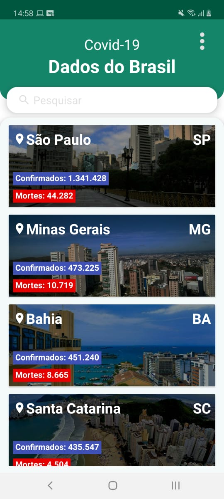
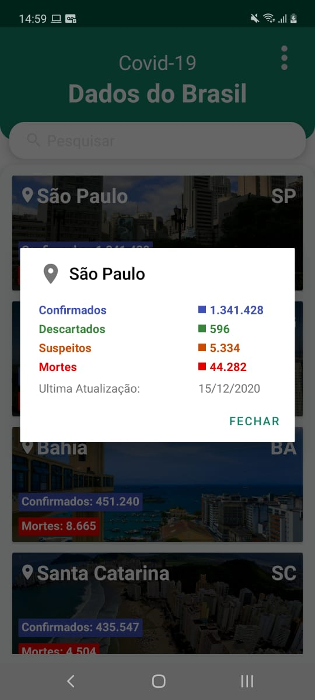
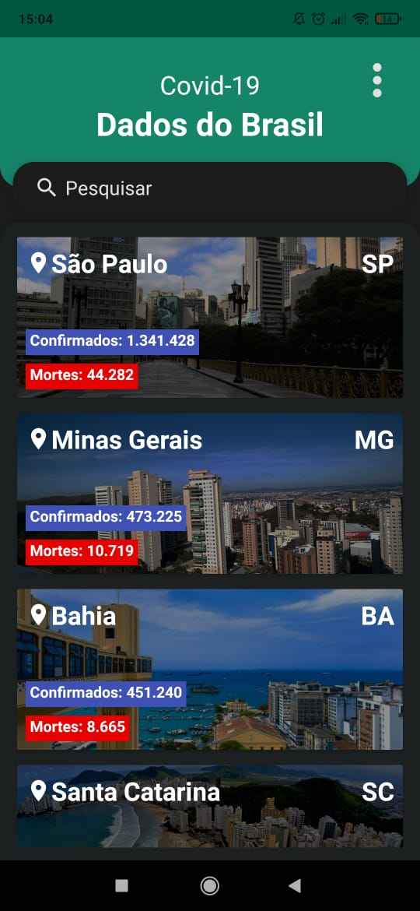
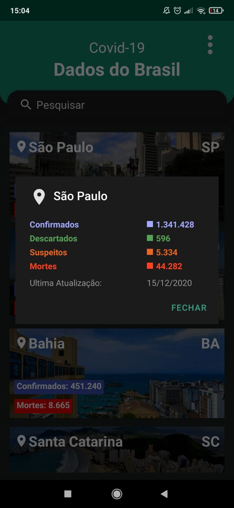

# Covid19 Dados do Brasil
Esta aplicação tem como intuito facilitar o acesso a informações sobre a Covid-19 referente aos estados brasileiros. Este projeto foi criado como parte do processo seletivo do "Formação em Tech - Mobile Android" da empresa 4all.

|                                  |                                  |                                  |                                  |
| :------------------------------- | :------------------------------: | :------------------------------: | :------------------------------: |
|  |  |  |  |
|                                  |                                  |                                  |                                  |

## Tecnologias utilizadas:

- [Java](https://www.java.com/pt-BR/) como linguagem principal.
- [Android Studio](https://developer.android.com/studio) como IDE utilizada.
- [COVID-19 Brazil API](https://covid19-brazil-api.now.sh/) utilizada para recuperar dados referentes a Covid-19.

## Diferenciais
- Este aplicativo possui recurso de acessibilidade para deficientes visuais.
- Dados são consumidos de serviços de terceiros.
- Tema atual e pertinente para a sociedade.

## Autor

<table>
  <tr>
    <td align="center">
        <a href="https://github.com/vazaee">
            
             
            <b>Gabriel Vaz</b>
             
            </a><a title="Code">💻</a>
            </a><a title="Design">🎨</a>
        </a>
    </td>
  <tr>
</table>
